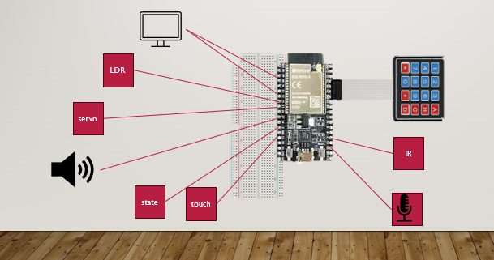

# Gemy V1.0.0

## What is it
Gemy is simple Maquette simulate a robot that implements Google gemini API to fetch results

## Semantices

## abstract of how it works 
-In order to implement the chat ,we need to call the gemini API to send and receive message.
-Unfortunately : the python gemini api not supported for esp32 micropython /C
-so we need to use server module

- the best choice is mqtt service (free eclipse ip) ,as it is TCP so efficent than http (requests /Cloud Functions)

#### ESP code
-the code is organized in 4 python modules to keep it not complicated
-the Servo module ,lcd_eye ,utils ,firebase :each hide unnecessary complication of functions e.g. connect wifi
-the main script “mqtt_prepare_no_mic” which execute main ,call mqtt ,and it’s called in boot file 
Lcd_eye : make eye by using custom char of eye ,consist of 6 consequence chars
-at first lcd may give strange value so prepareLcd() to set it by made chars for seconds then clear
-sevo not worked good ,may due limit in electricity so implemented servo optimized by small angle 

#### app code
-android java app is used to get state and setup the connection for the robot
-for message it directly call the message topic
-it uses firebase to set connections ,and settings

## Security implemented
- using passwords 

## Limit Version
- the version not use security in mqtt server
- limit in keypad
- the app in test mode so some features not work
- app settings not applied due to memory full 

## Full documentation :
[Documentation](files/report_project.docx)

## Demo :
https://drive.google.com/file/d/1OoTq3I9fxtxAOTANQALYn_WZHaztmRLm/view?usp=drive_link 
https://drive.google.com/file/d/16m1N2Ex4vi4AC1swpYj8I6dGdjysm521/view?usp=drive_link 
https://drive.google.com/file/d/1qvsTQOxUyhHvkRBUiXIPEyWHKeiiNKcG/view?usp=drive_link 

## Me tahaelshrif1@gmail.com with the team :
•	Mazen ElSayed  , Omar mohab ,Omar Essam

Thanks to Eng.Mohammed Hatem 